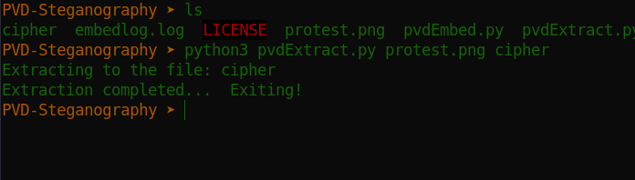

# CTF Name: Steg_FTW

  
  


## Description
How often do you read steganography research papers?, the spectogram looks nice.what does it hide (75pts)
## Attached files
- [spectro.zip](./files/spectro.zip)

## Summary
This challenge was about Pixel value differencing where LSB substitution and PVD are both applied. In PVD process, non-overlapping 3x3 pixel blocks or a combination of 3x3 and 2x2 blocks are used in a raster pattern(side to side) from top to bottom 
Extraxtion is done using a generated log file from embedding that contains data locations in the steg Image
```
ah{redacted}
```

## Detailed solution
Doing a bit of research on PVD Steg, considering the files provided in the challenge(embed.log), i found one tool that reveals hidden message using a given log file.The [repo](https://github.com/TonyJosi97/pvd_steganography) shows a python implementation of pixel-value-differencing. We can tell that we are in the right place by reading the instructions which shows that the tool uses embed.log to map data points of the concealed message
so:
git clone <repo>
cd <repo>
open the pvdextract.py in a code editor and replace the logfile name with ours(embedlog.log). Run the script with the command

  Python3 PVDExtract.py protest.png cipher
- protest.png - image with concealed message
- cipher = output_file
This will spit the flag
  


##Takeaways
  
From the paper **The traditional steganography methods with Pixel Value Differencing (PVD) usually only deal with the PVD in the horizontal direction but ignore the vertical one. In this paper, the cover image is divided into 2×2 nonoverlapping blocks, then the modulus function method is used in horizontal direction and the simple PVD method is used in vertical direction for steganography.**
