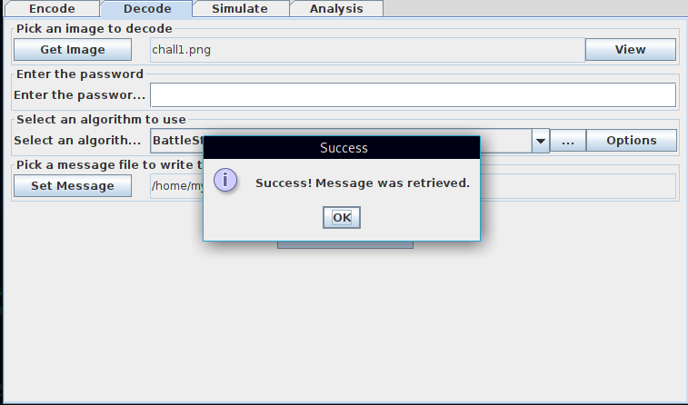

# CTF Name: Steg_FTW

  
  


## Description
i heard you likes memes XD » hint=John Cena :)
## Attached files
- [chall1.png](./files/chal1.png)

## Summary
This challenge was about digital Invisible ink..which is a method used to conceal a message through steganography. The idea behind it is replacing some information with a concealed message through a cover object. This makes any digital stream a viable carrier.
## Flag
```
ah{redacted}
```

## Detailed solution
Doing a bit of research on digital ink steg, led me to one java tool that could successfuly decrypt digital ink steg. The DIIT project can be found at http://diit.sourceforge.net/.Download the tool and load the image.I used the battle steg algorithm which successfully decrypted the concealed image to a text file



## Takeaways
With the rich playground of digital streams and formats, more uncommon steg methods are always being invented.
