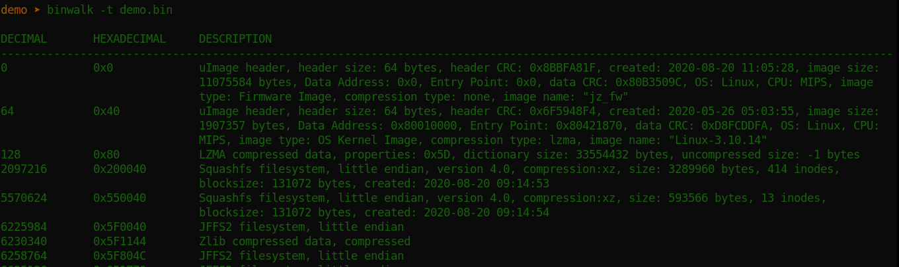
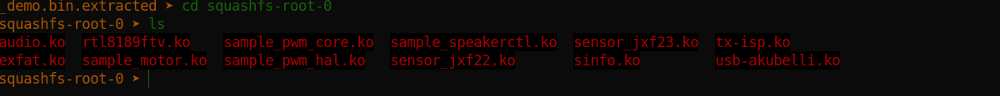
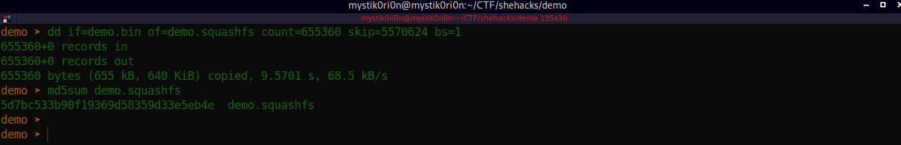

# CTF Name: Drivers

  
  


## Description
What is the MD5 hash of the unextracted driver filesytem contained in the firmware?

Flag format is: Hackfest{answer}

## Attached files
- [demo.zip](./files/demo.zip)

## Summary
This was the first challenge i solved which had a little trick in it too that required precision carving. The challenge required us to get the md5 of the folder with drivers in the one of the squash file system.
## Flag
```
Hackfest{redacted}
```

## Detailed solution

This challenge required the use of binwalk and dd to successfully carve the filesystem. At first i tried extracting with binwalk and got a folder that contained drivers 
```
binwalk -e demo.bin
```



We have the extracted filesystem and can determine that our target fs is the second squashfs in the binwalk output above.The '-t' option tells binwalk to fit the output in the terminal which looks more organised. Now to precisely carve the squashfs, we make use of the 'count' option in dd. 

**dd is a powerful tool. Be careful while using it with the options 'if' and 'of'. Setting this to the wrong value will ruin your day :) or your week if you trash your harddrive.**

```
if = file we want to carve
of = save it as this after carving

dd if=demo.bin of=demo.squashfs skip=5570624 count=655360 bs=1
 
- count = (JFFS2 offset) 6225984 - (target-squashfs offset) 5570624  
 ```
 
 
 The md5sum was the flag

## Takeaways
To successfully carve independent files in a firmware or any media with embedded files, calculating the count to use in dd is a great way to get the precise files.
