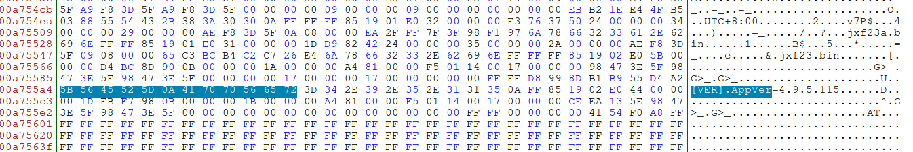

# CTF Name: Firmware Version

  
  


## Description
What is the firmware version?

Flag format is: Hackfest{answer}

## Attached files

- [demo.zip](./files/demo.zip)

## Summary

When solving this challenge i used kind of a guessy technique but it has something to teach too. 

## Flag
```
Hackfest{redacted}
```

## Detailed solution

After an unfruitful search for the firmware versiom, i decided to utilise some grep and regex skills to get everything with a version format. As you know, versions are often written in the format x.xx.xx.xx or close to that. I searched for a regex that could help me grep for such a format
Here is the command i used:

```
egrep -o -a "([0-9]{1,}\.)+[0-9]{1,}" demo.lzma `

- ([0-9]{1,}\.)+ = match atleast a block of [0-9]{1,} and '.'
- [0-9]{1,} = match a block of [0-9] 

```


As Shown in the image, from all outputs, only the two values at the end made sense as the firmware version. 4.9.5.115 was the correct firmware version

## Another solution

However, without using guess work, i also found another viable solution. The kernel image dumped using the dumpimage had the firmware version displayed as shown below


 
##Takeaways

There are more ways to approach a problem and whatever works for you at the moment is the viable solution. Mine was the guessy solution but i still learned some regex from the result.
