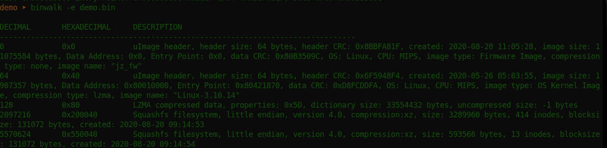

# CTF Name: Challenge name

  
  


## Description
The kernel has been padded at the end. At what byte from the start of the kernel does the padding start? Provide the answer in decimal.

Flag format is: Hackfest{answer}
## Attached files
- [demo.zip](../files/demo.zip)

## Summary
The CTF had two sections -This challenge came from a forensic section. The target for our forensic analysis is a firmware dumped from a camera. Our goal in this challenge being to dump the kernel image and determine the padding at the end of the kernel
## Flag
```
Hackfest{redacted}

```

## Detailed solution
This challenge was the last one we solved meaning it was the most tricky :) .At first, i tried extracting the firmware with binwalk but that was just a big mess of files that could not help me get to the kernel. I went for a more precision tool, dd.
my first attempt was to grab only the lzma at the bytes 128 as shown below in the binwalk output. 
dd if=demo.bin of=demo.lzma bs=1 skip=128


```
#include <stdio.h>
int main()
{
   printf("Hello, World!");
   return 0;
}
```

**Duis aute irure dolor** in reprehenderit in voluptate velit esse cillum dolore eu fugiat nulla pariatur. Excepteur sint occaecat cupidatat non proident, sunt in culpa qui officia deserunt mollit anim id est laborum.

## Another solutions
Lorem ipsum dolor sit amet, consectetur adipiscing elit, sed do eiusmod tempor incididunt ut labore et dolore magna aliqua.
