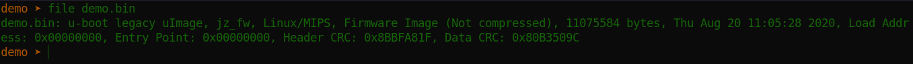
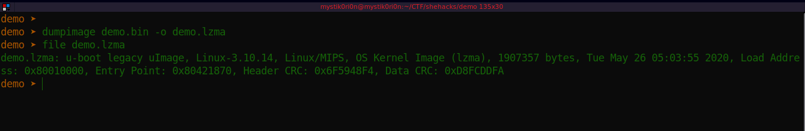
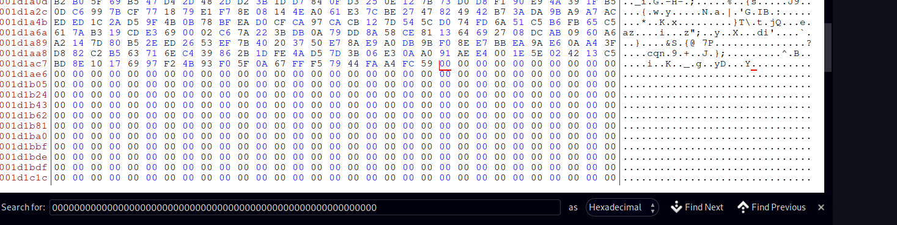
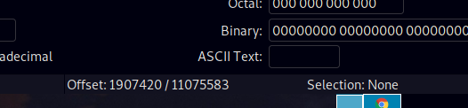

# CTF Name: Kernel Padding

  
  


## Description
The kernel has been padded at the end. At what byte from the start of the kernel does the padding start? Provide the answer in decimal.

Flag format is: Hackfest{answer}
## Attached files
- [demo.zip](../files/demo.zip)

## Summary
The CTF had two sections -This challenge came from a forensic section. The target for our forensic analysis is a firmware dumped from a camera. Our goal in this challenge being to dump the kernel image and determine the start of padding at the end of the kernel.
## Flag
```
Hackfest{redacted}

```

## Detailed solution
This challenge was the last one we solved and being the firstblood, meant it was the most tricky :) .At first, i tried extracting the firmware with binwalk but that was just a big mess of files that could not help me get to the kernel. I went for a more precision tool, dd.
my first attempt was to grab only the lzma(This is the compressed kernel image) at the bytes 128 as shown below in the binwalk output below.
 


The command to carve the lzma.
```
dd if=demo.bin of=demo.lzma bs=1 skip=128 count=2097088
- count = number of bytes to get (start_bytes of the next file - start bytes of the file we are carving) -> squashfs offset - lzma offset
- bs = blocksize (1mb sizes of the blocks)  
- skip= skip to offset(precision)

```
After dd ges me the lzma, my plan is to extract the lzma with unlzma tool but the file had other plans for me, it was corrupted.
I took hours trying to figure out why i was getting a corrupt image.
Finally i decided to start at the basics and understand what kind of file i was working on. i had previously ignored the output from file command, which ultimately helped me figure the challenge out
This is output from the file command


As you can see, we are dealing with an u-boot legacy uImage. A bit of research on this firmware-image format, i came across a tool; Dumpimage ,that extracts files from a uImage.



This was the output i got and you can see that our demo.lzma file is now a legit OS Kernel Image. Now we look for the padded section and find the offset. My go to editor for editing hexdump is bless editor. i opened the kernel in bless and used the search option to look for "00000000000000000000" ,yeap!..A lot of zeroes. Padding is where zeroes are added to input with the aim to obtain equality, or just CTF :)




You can see the start of padding selected in the first image and displayed on the second image. And that was our flag.

##Takeaways

As always told, enumeration and information gathering is always important to understand the target before going for the hit ;). Which was the case in this challenge.
